# System Architecture Overview
## Tổng quan Kiến trúc Hệ thống

---

## 🎯 Architecture Goals / Mục tiêu Kiến trúc

### Tiếng Việt
- **Scalability**: Dễ dàng mở rộng theo chiều ngang và chiều dọc
- **Maintainability**: Dễ bảo trì, debug và cập nhật
- **Testability**: Hỗ trợ unit testing và integration testing
- **Security**: Bảo mật cao với authentication và authorization
- **Performance**: Tối ưu hóa hiệu suất và response time
- **Flexibility**: Linh hoạt trong việc thay đổi và mở rộng tính năng

### English
- **Scalability**: Easy horizontal and vertical scaling
- **Maintainability**: Easy to maintain, debug, and update
- **Testability**: Support for unit testing and integration testing
- **Security**: High security with authentication and authorization
- **Performance**: Optimized performance and response time
- **Flexibility**: Flexible in changing and extending features

---

## 🏗️ High-Level Architecture / Kiến trúc Tổng quan

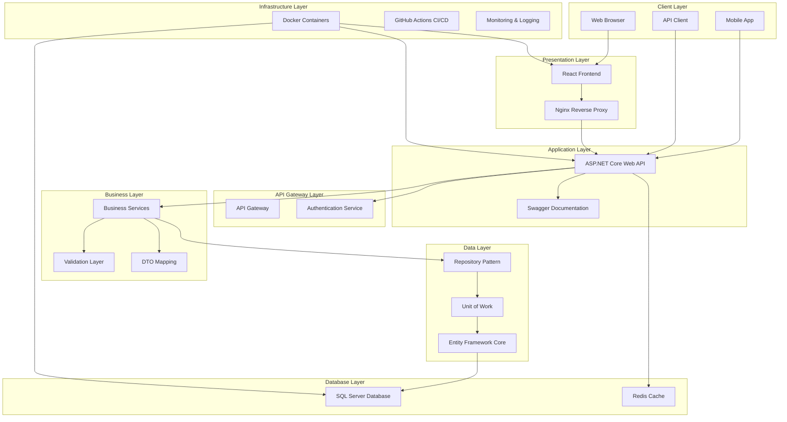

---

## 🔧 Clean Architecture Implementation / Triển khai Clean Architecture

### Tiếng Việt

#### Nguyên tắc Dependency Inversion:
- Các layer bên trong không phụ thuộc vào layer bên ngoài
- Interface được định nghĩa ở layer bên trong
- Implementation được thực hiện ở layer bên ngoài

#### Các Layer chính:

1. **Entities** (BE.DAL/Models): Core business objects
2. **Use Cases** (BE.Services): Business logic và rules  
3. **Interface Adapters** (BE.API/Controllers): Convert data formats
4. **Frameworks & Drivers** (Infrastructure): External systems

### English

#### Dependency Inversion Principle:
- Inner layers don't depend on outer layers
- Interfaces defined in inner layers
- Implementations provided by outer layers

#### Main Layers:

1. **Entities** (BE.DAL/Models): Core business objects
2. **Use Cases** (BE.Services): Business logic and rules
3. **Interface Adapters** (BE.API/Controllers): Convert data formats
4. **Frameworks & Drivers** (Infrastructure): External systems

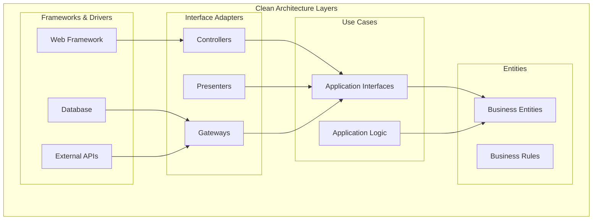

---

## 🌐 Frontend Architecture / Kiến trúc Frontend

### React Component Architecture

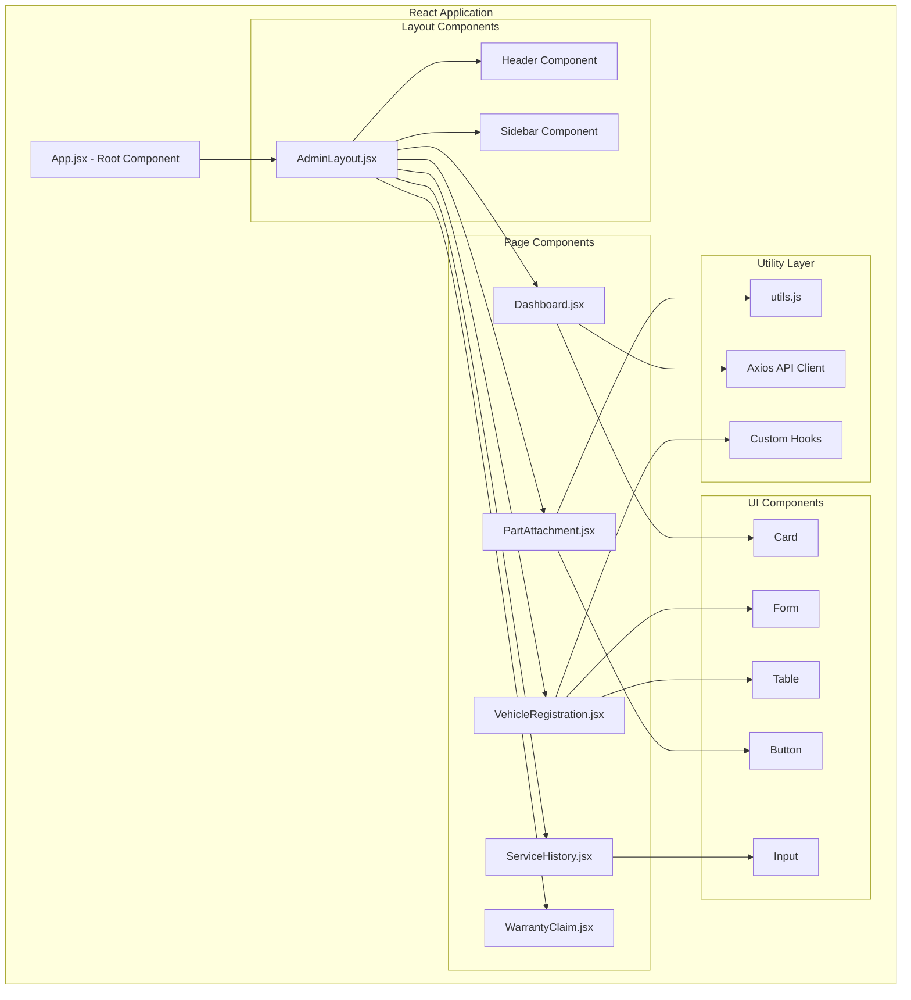

---

## 🔐 Security Architecture / Kiến trúc Bảo mật

### Authentication & Authorization Flow

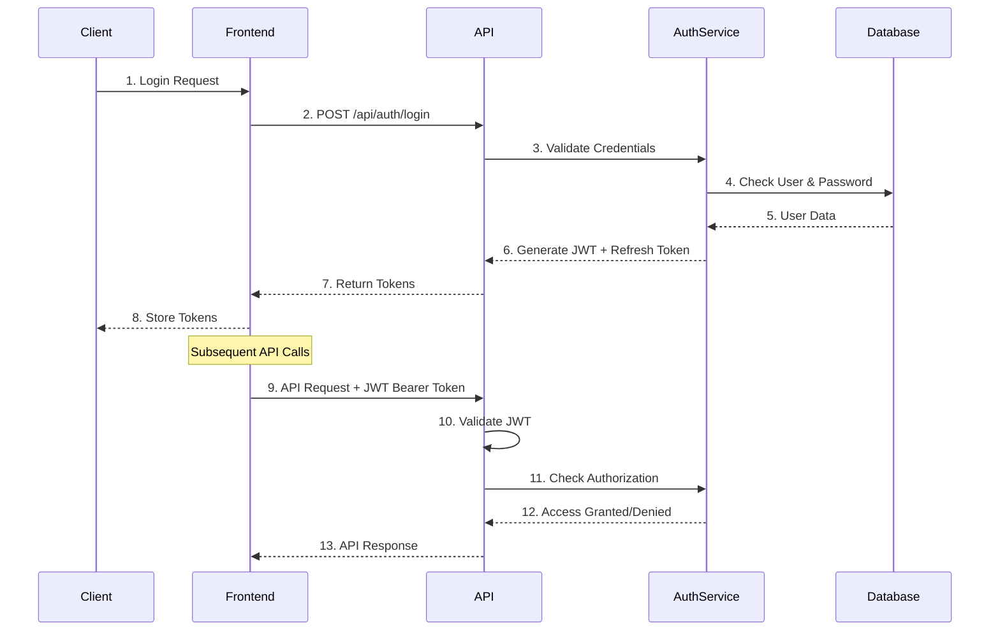

### Role-Based Access Control (RBAC)

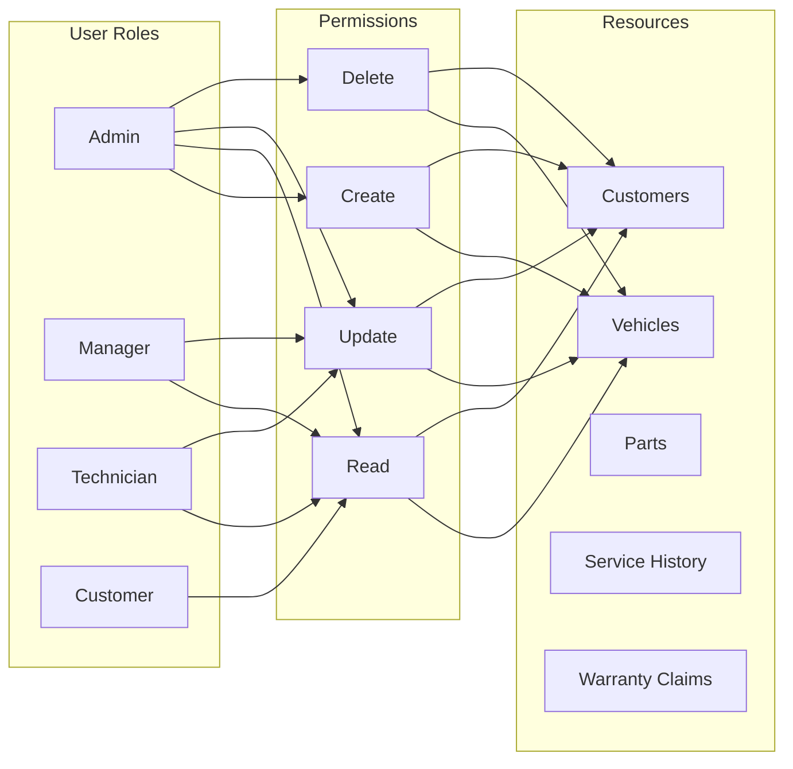

---

## 📊 Data Architecture / Kiến trúc Dữ liệu

### Database Schema Design

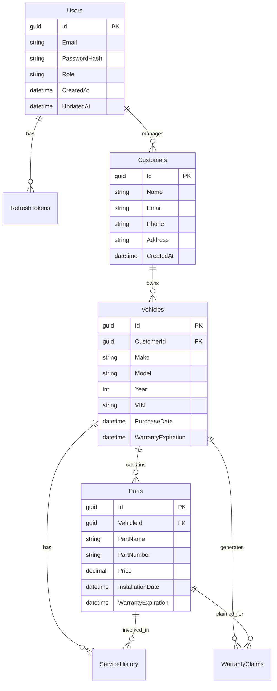

### Repository Pattern Implementation

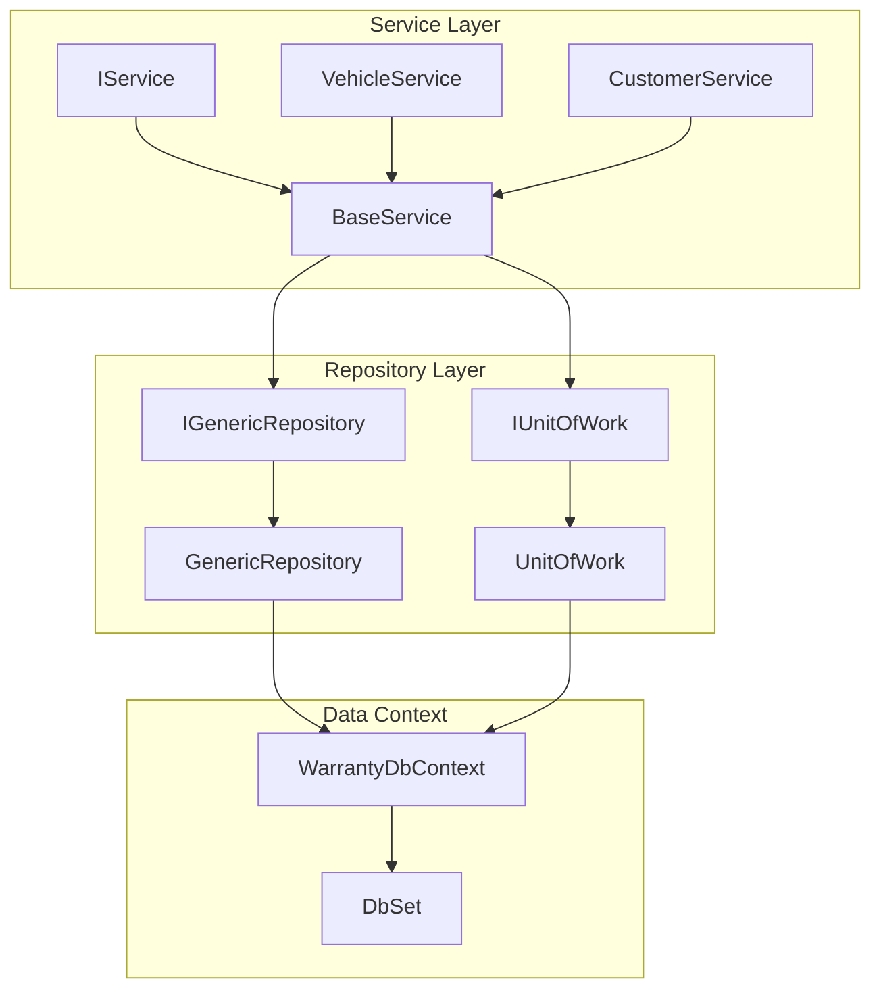

---

## 🚀 DevOps Architecture / Kiến trúc DevOps

### CI/CD Pipeline

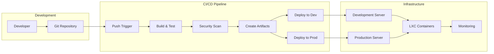

### Container Architecture

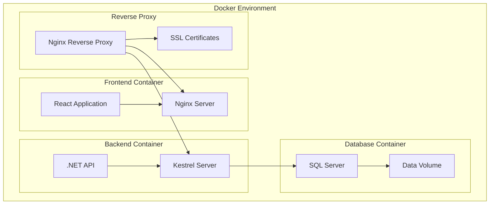

---

## 📈 Performance Architecture / Kiến trúc Hiệu suất

### Caching Strategy

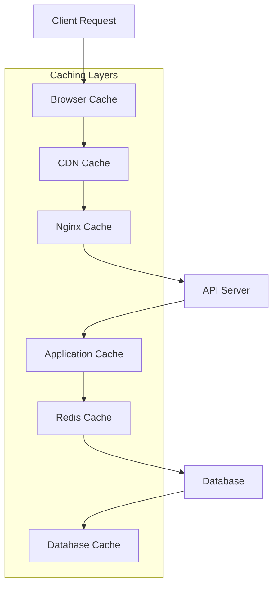

### Load Balancing & Scaling

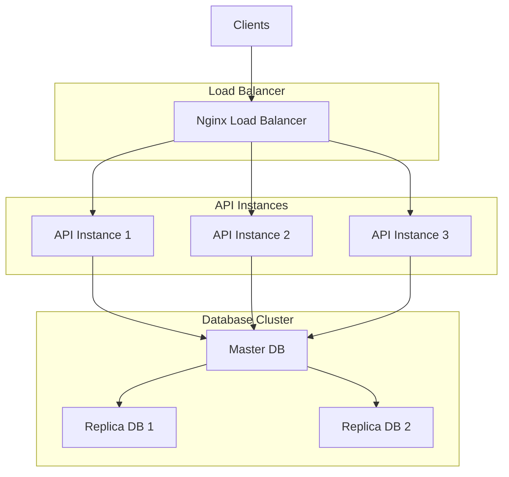

---

## 🔍 Monitoring & Logging / Giám sát & Ghi log

### Observability Stack

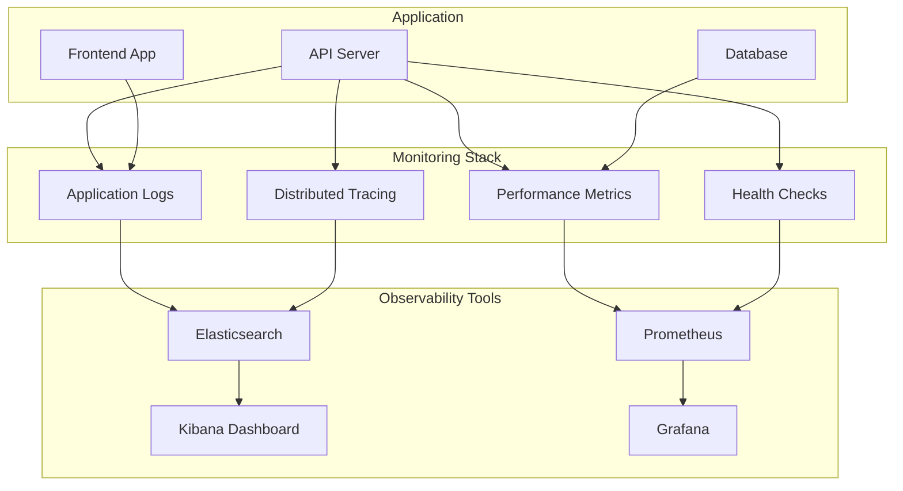

---

## 🛡️ Security Considerations / Các khía cạnh Bảo mật

### Security Layers

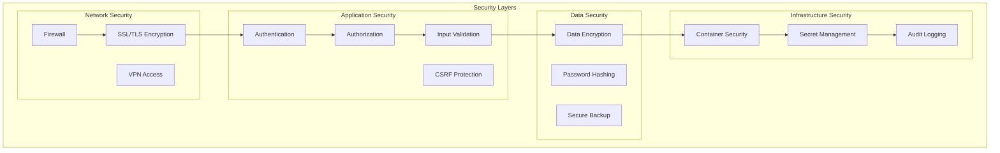

---

## 📋 Best Practices Implemented / Best Practices Được áp dụng

### Tiếng Việt

#### Backend Best Practices:
- ✅ **SOLID Principles**: Tuân thủ các nguyên tắc thiết kế SOLID
- ✅ **Clean Code**: Mã nguồn sạch, dễ đọc và bảo trì
- ✅ **Exception Handling**: Xử lý lỗi toàn diện
- ✅ **Async/Await**: Lập trình bất đồng bộ
- ✅ **Dependency Injection**: Loose coupling
- ✅ **Repository Pattern**: Trừu tượng hóa data access
- ✅ **Unit of Work**: Quản lý transaction

#### Frontend Best Practices:
- ✅ **Component Reusability**: Tái sử dụng components
- ✅ **State Management**: Quản lý state hiệu quả
- ✅ **Performance Optimization**: Tối ưu hóa hiệu suất
- ✅ **Responsive Design**: Thiết kế responsive
- ✅ **Accessibility**: Hỗ trợ accessibility
- ✅ **Error Boundaries**: Xử lý lỗi React
- ✅ **Code Splitting**: Phân chia mã nguồn

### English

#### Backend Best Practices:
- ✅ **SOLID Principles**: Following SOLID design principles
- ✅ **Clean Code**: Clean, readable, and maintainable code
- ✅ **Exception Handling**: Comprehensive error handling
- ✅ **Async/Await**: Asynchronous programming
- ✅ **Dependency Injection**: Loose coupling
- ✅ **Repository Pattern**: Data access abstraction
- ✅ **Unit of Work**: Transaction management

#### Frontend Best Practices:
- ✅ **Component Reusability**: Reusable components
- ✅ **State Management**: Efficient state management
- ✅ **Performance Optimization**: Performance optimization
- ✅ **Responsive Design**: Responsive design
- ✅ **Accessibility**: Accessibility support
- ✅ **Error Boundaries**: React error handling
- ✅ **Code Splitting**: Code splitting

---

*Kiến trúc này được thiết kế để đáp ứng các yêu cầu của một ứng dụng enterprise với khả năng mở rộng, bảo mật cao và hiệu suất tốt.*

*This architecture is designed to meet enterprise application requirements with scalability, high security, and good performance.*
